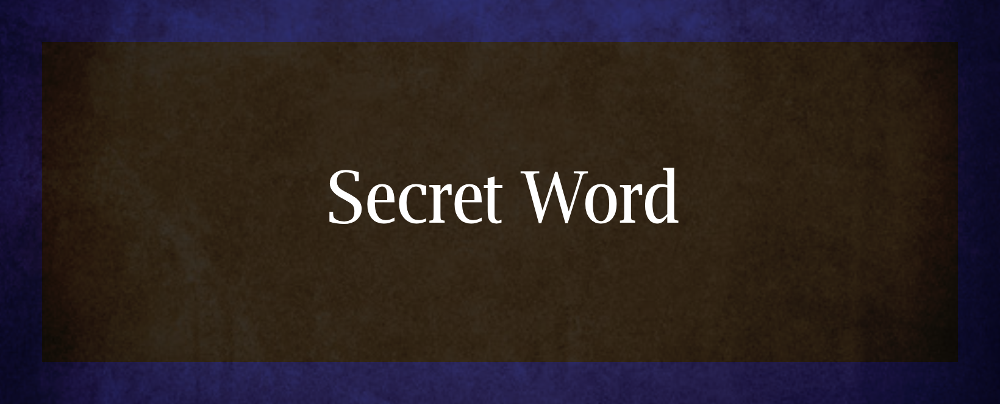

# Secret Word

Secret Word is an engaging and fun word-guessing game designed to challenge your vocabulary and deduction skills. Players are tasked with guessing a hidden word based on hints and limited attempts, providing a thrilling and interactive experience.

## Features
- **Interactive Gameplay**: Engage in a captivating word-guessing experience.
- **Dynamic Interface**: User-friendly interface for seamless gameplay.
- **Responsive Design**: Optimized for various devices and screen sizes.

---

## Technologies Used
<table align="left">
  <tr>
    <td align="center">
      <a href="https://developer.mozilla.org/en-US/docs/Web/HTML/">
         
        <b>HTML</b>
      </a>
    </td>
    <td align="center">
      <a href="https://developer.mozilla.org/en-US/docs/Web/CSS/">
         
        <b>CSS</b>
      </a>
    </td>
    <td align="center">
      <a href="https://www.javascript.com/">
         
        <b>JavaScript</b>
      </a>
    </td>
    <td align="center">
      <a href="https://reactjs.org/">
         
        <b>React</b>
      </a>
    </td>
  </tr>
</table>

       
   

## Live Demo
Experience the game at [Secret Word](https://your-game-link-here.com).
